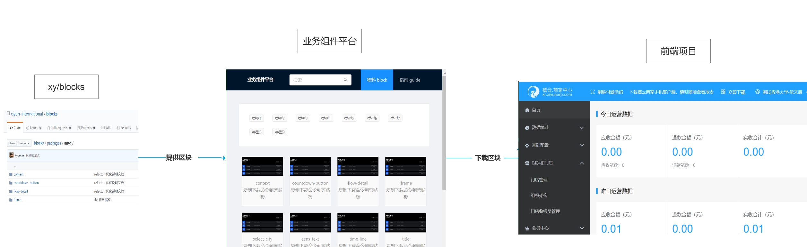
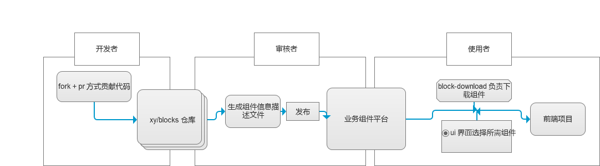
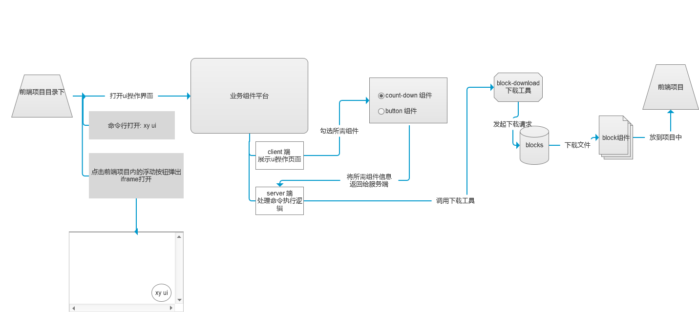
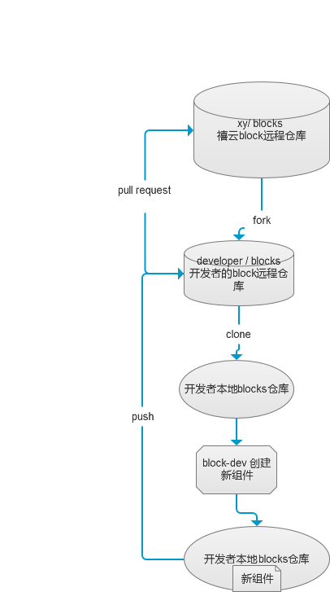
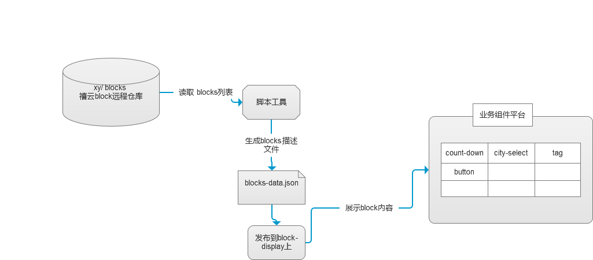
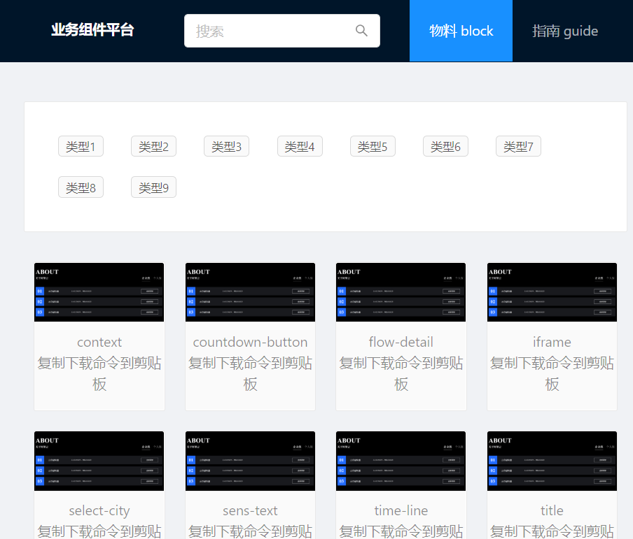
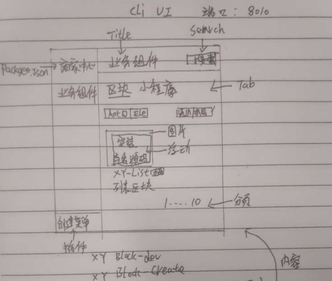
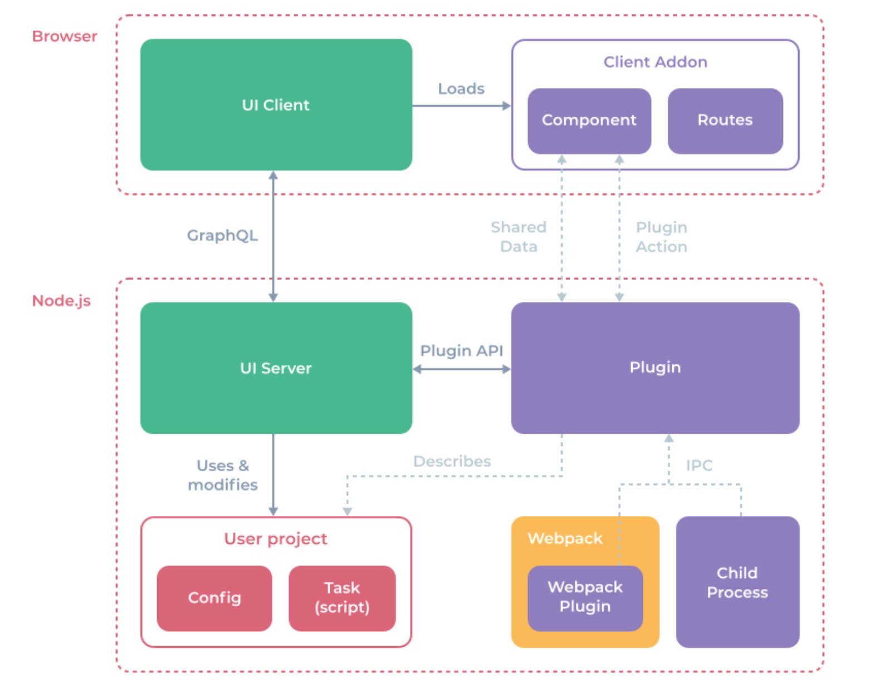

#  禧云组件平台，一期设计规划

## 背景

当交互提出，商家中心项目会新增一个城市选择的模块；我们第一印象是：在之前开发过的项目中寻找相似的组件，尽量让它复用，来减少开发成本。
因为之前没有一个中间的平台，无法直观的把历史组件展示出来。所以每次只能去 GitLab 仓库中寻找相似的组件，这种查找方式只能通过代码搜索，或全凭记忆。
找的过程会浪费大量的时间，也无法保障这些组件在团队中进行有效的传承。所以我们希望有一个中心化的平台，来展示我们曾经开发过的组件。

此外，我们在使用 xy 生态中的 CLI 工具时，虽然可以极大的提升开发效率，但是发现其体验其实可以更上一层楼。例如：我们在使用 xy generator 下载通用模板时，需要在命令行中追加多个参数来设置模板的类型。这些参数的顺序和格式稍稍有些复杂，导致使用者可能需要查阅文档使用。如果有一个 UI 界面能辅助我们使用这些命令，那么体验会更好，让我们更专注于业务开发。

### 目前存在的问题

1. 不同项目中有很多组件是重复开发的，良莠不齐

2. 找业务组件需要下载项目找，费时费力

3. 组件库文档组件查找麻烦，毫无体验

4. 组件库组件不能满足每个项目的定制化，千篇一律

5. 当前 xy 命令行工具使用体验不佳，有碍提效

## 解决方案

我们希望，有一个 Git 仓库用来存放公司内可能用到的业务组件，工程师们通过一个 UI 界面来快速找到所需的业务组件，同时 UI 界面也提供了例如将所需组件直接下载到项目的一条龙服务。

同时工程师也可以将自己认为有价值的组件上传到该 Git 仓库中，以便自己和我人日后使用方便。

所以需要开发一个流程及其配套设施来解决上述问题。	

## 流程描述

### 总览

总体的运作流程如下图

#### 关键词解释

1. 区块：业务级组件

2. 业务组件平台：用于展示，下载 blocks 的平台。在 Web 端和 UI 端都会实现Web 端在后文会或被简称为 block-display

### 不同的角色，不同的流程

作为一个前端人员

1. 可以作为一个 `使用者` 使用已完成的区块

2. 也可以作为 `开发者`贡献新的区块

3. 如果有丰富的经验，也可以作为`审核者`负责对区块的审核和后续发布

#### 使用者的流程

#### 开发者的流程

#### 审核者的流程

## 需要开发的元素

### 1. 业务组件平台

#### Web 端

具备区块的展示，下载功能

#### UI 端

初期具备区块的展示，下载功能

后期会增加新的功能（对 xy 命令的增加可视化操作）

##### 原型图

##### 初步技术实现思路

UI 端的实现初步准备参考 Vue UI 的实现方式

### 2. blocks 物料 Git 仓库

1. 存放 blocks 组件

### 3. block-dev 开发工具

1. 启动一个服务提供组件开发的基础环境

### 4. 区块描述文件生成器

1. 扫描 blocks 仓库中的组件，成一个 block-data.json 描述文件，因为最终描述文件会放在 block-display 里面，所以该生成器暂时也放在 block-display 里面

## 开发任务分工

| 任务描述                                   |         负责人       |
| :-------------------------- | :-------------------------------------------------------- |
| 把控工程的核心功能的发展趋势，相关技术的尝试性探索以便后续开发应用 | 吴佰清                                                    |
| 完善 `block create` ，`block dev`，`block` 下载等功能        | 赵亮                                                      |
| 业务组件平台 UI 端如何加入 xy 生态其他插件                   | 于月                                                      |
| 开发业务组件平台 Web 端的相关页面                            | 胡强强                                                    |
| 通过 Socket/IPC 让 UI 界面使用 xterminal 实时获取 server 端的区块安装情况 | 李明月                                                    |
| 如何在前端项目的 package.json 中做配置以便批量下载区块       | 常文霞                                                    |
| 将区块的截图上传到七牛云的最佳实践业务组件平台 UI 端的整体技术实现方式以及 graphQl 如何与之配合完整基础的 UI 端功能 | 杨一帆                                                    |

## 需要讨论的问题

## 竞品调研

| 竞品                                                           | 功能               | 优点                   | 缺点                                                    |
| -------------------------------------------------------------- | ------------------ | ---------------------- | ------------------------------------------------------- |
| [阿里飞冰](https://ice.work/block)                             | 前端项目生成器     | 可视化的区块展示       | vue 支持不好                                            |
| [bit](https://bit.dev/components)                              | 组件可视化展示     | 可调式，可视化组件列表 | 须发 npm 包                                               |
| [Angular Console](https://angularconsole.com/)                 | 项目配置工具       |                        | 基于 Electron 导致打包文件过大                          |
| [Vue UI](https://cli.vuejs.org/zh/dev-guide/ui-info.html#logo) | 脚手架可视化工具  | Vue 官方产品           | 学习 API 成本过高，需要安装禧云生态以及 Vue UI 两套工具 |

### 调研结果
1. 目前没有能完全满足需求的产品，需要开发
2. 可借鉴的：可视化组件列表，在线调试界面可借鉴 bit ，但是以具体需求为准

 

 

 

