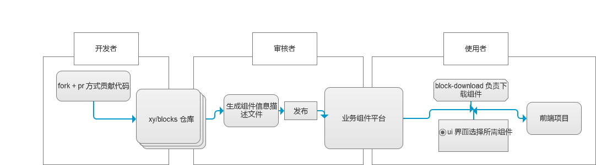

# xy block 物料平台(一期)

## 背景

### 在日常的前端开发中，经常遇到如下的场景:

场景1：

我在维护商家中心项目，产品需要在页面增加一个城市选择器，为了减少开发成本，我会优先看其我前端项目中有没有可以用到的现成组件，于是我开始一个个的对 Gitlab 上的前端项目进行检索，于是我浪费了 20 分钟寻找组件。

场景2：

我没有找到所需的组件，于是我花 1 小时自己开发了一个城市的组件得以满足需求。直到后来修复渠道商的一个 bug 的时候，才发现相关页面里其实已经有城市选择组件了，只不过之前没发现。这意味这之前用于组件开发的 1 小时实际上白白浪费了。

场景3：

即使 ant-design 组件库提供的组件可以满足我的需求，它的文档的组件搜索方式也不甚友好，我依然需要到左侧不能搜索的导航栏，逐个点开每个组件寻找自己需要的。

### 上述问题点总结:

1 不同项目中有很多组件是重复开发的，良莠不齐

2 找业务组件需要下载项目找，费时费力

3 组件库文档组件查找麻烦，毫无体验

4 组件库组件不能满足每个项目的定制化，千篇一律

## 解决方案

我们希望，有一个 Git 仓库用来存放公司内可能用到的业务组件，工程师们通过一个 UI 界面来快速找到所需的业务组件，同时 UI 界面也提供了例如将所需组件直接下载到项目的一条龙服务。

同时工程师也可以将自己认为有价值的组件上传到该 Git 仓库中，以便自己和我人日后使用方便。

所以需要开发一个流程及其配套设施来解决上述问题。	

## 流程描述

### 总览

总体的运作流程如下图

#### 关键词解释

1 区块：业务级组件

2 业务组件平台：用于展示，下载 blocks 的平台。在 web 端和 client 端都会实现

web端在后文会或被简称为 block-display

### 不同的角色，不同的流程

作为一个前端人员

1 可以作为一个 `使用者` 使用已完成的区块

2 也可以作为 `开发者`贡献新的区块

3 如果有丰富的经验，也可以作为`审核者`负责对区块的审核和后续发布

#### 使用者的流程

#### 开发者的流程

#### 审核者的流程

## 需要开发的元素

### 1 业务组件平台

#### web端

具备区块的展示，下载功能

#### cli端

初期具备区块的展示，下载功能

后期会增加新的功能（对其我 xy 命令的可视化操作）

##### 原型图

##### 初步技术实现思路

cli端的实现初步准备参考 vue ui 的实现方式

### 2 blocks 物料Git仓库

1 存放 blocks 组件

### 3 block-dev 开发工具

1 启动一个服务提供组件开发的基础环境

### 4  区块描述文件生成器

1 扫描 blocks 仓库中的组件，成一个 json 描述文件，因为最终描述文件会放在 block-display 里面，所以该生成器暂时也放在 block-display 里面

## 需要讨论的问题

## 竞品调研

### 调研表格

| 竞品                                        | 功能                     | 优点                      | 缺点               |
| ------------------------------------------- | ------------------------ | ------------------------- | ------------------ |
| 阿里飞冰                                    | 前端项目生成器           | 可视化的区块展示          | vue 支持不好       |
| [bit](https://bit.dev/components)           | 组件可视化展示           | 可调式，   可视化组件列表 | 须发npm包          |
| ant / element    组件库文档                 | 组件库文档               |             | 没有可视化组件列表 |

### 调研结果

1 目前没有能完全满足需求的产品，需要开发

2 可借鉴的

可视化组件列表，在线调试界面可借鉴 bit ，但是以具体需求为准

 

 

 

